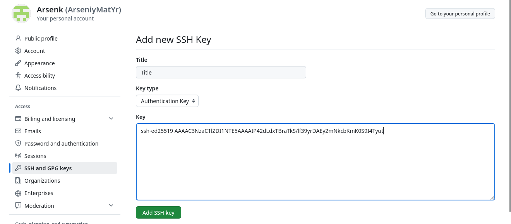
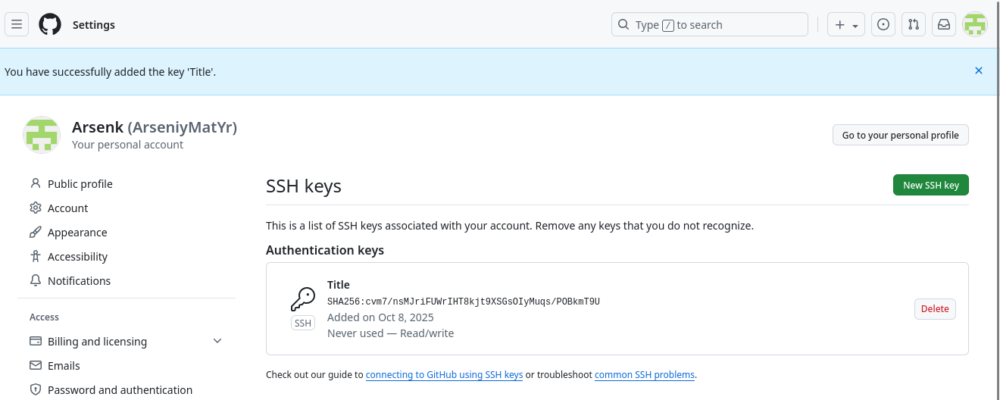
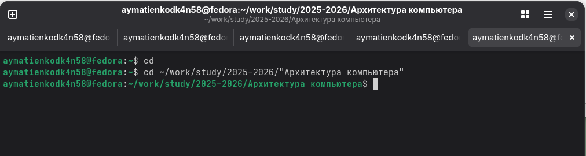

**РОССИЙСКИЙ УНИВЕРСИТЕТ ДРУЖБЫ НАРОДОВ**
**Факультет физико-математических и естественных наук**
**Кафедра прикладной информатики и теории вероятностей**

**ОТЧЕТ**
**по лабораторной работе № 2**
*дисциплина:	Архитектура компьютера*

Студент: Матиенко 
Арсений Юрьевич

	Группа: НБИбд-02-25

**МОСКВА**
2025 г.

**Оглавление**
1. Цель работы.	3
2. Теоретическое введение.	3
2.1. Системы контроля версий. Общие понятия.	3
2.2. Система контроля версий Git.	3
2.3. Основные команды git.	4
2.4. Стандартные процедуры работы при наличии центрального репозитория.	5
3. Выполнение лабораторной работы.	6
3.1. Настройка github.	6
3.2. Базовая настройка git.	6
3.3. Создание SSH-ключа.	7
3.4. Создание рабочего пространства и репозитория курса на основе шаблонов.	9
3.5. Создание репозитория курса на основе шаблона.	10
3.6. Настройка каталога курса.	12
4. Задание для самостоятельной работы.	14
5. Вывод.	17

Ссылка на профиль в GitHub: https://github.com/ArseniyMatYr/study_2025-2026_arh-pc

#**1. Цель работы.**
	-Целью работы является изучение идеологии и применения средств контроля версий, приобретение практических навыков по работе с системой контроля версий git.
	
	
#**2. Теоретическое введение.**
##**2.1. Системы контроля версий. Общие понятия.**
	-Системы контроля версий (VersionControlSystem,VCS) применяются при работе нескольких человек над одни проектом. Обычно основное дерево проекта хранится в локальном или удалённом репозитории, к которому настроен доступ для участников проекта. При внесении изменений в содержание проекта система контроля версий позволяет их фиксировать, совмещать изменения, произведённые разными участниками проекта, производить откат к любой более ранней версии проекта, если это требуется.
	-Системы контроля версий поддерживают возможность отслеживания и разрешения конфликтов, которые могут возникнуть при работе нескольких человек над одним файлом. Можно объединить (слить) изменения, сделанные разными участниками (автоматически или вручную), вручную выбрать нужную версию, отменить изменения вовсе или заблокировать файлы для изменения. В зависимости от настроек блокировка не позволяет другим пользователям получить рабочую копию или препятствует изменению рабочей копии файла средствами файловой системы ОС, обеспечивая, таким образом, привилегированный доступ только одному пользователю, работающему с файлом.
	-Системы контроля версий также могут обеспечивать дополнительные, более гибкие функциональные возможности. Например, они могут поддерживать работу с несколькими версиями одного файла, сохраняя общую историю изменений до точки ветвления версий и собственные истории изменений каждой ветви. Кроме того, обычно доступна информация о том, кто из участников, когда и какие изменения вносил. Обычно такого рода информация хранится в журнале изменений, доступ к которому можно ограничить.
	-В отличие от классических в распределённых системах контроля версий центральный репозиторий не является обязательным.
	-Среди классических VCS наиболее известны CVS, Subversion, а среди распределённых — Git, Bazaar, Mercurial. Принципы их работы схожи, отличаются они в основном синтаксисом используемых в работе команд.
	
	
##**2.2. Система контроля версий Git.**
	-Система контроля версий Git представляет собой набор программ командной строки. Доступ к ним можно получить из терминала посредством ввода команды git с различными опциями.
	-Благодаря тому, что Git является распределённой системой контроля версий, резервную копию локального хранилища можно сделать простым копированием или архивацией.
	
	
##**2.3. Основные команды git.**
git init - создание основного дерева репозитория.
git pull - получение обновлений (изменений) текущего дерева из центрального
репозитория.
git push - отправка всех произведённых изменений локального дерева в
центральный репозиторий.
git status - просмотр списка изменённых файлов в текущей директории.
git diff - просмотр текущих изменений.
git add - добавить все изменённые и/или созданные файлы и/или каталоги.
git add - добавить конкретные изменённые и/или созданные файлы и/или
каталоги «имена_файлов».
git rm - удалить файл и/или каталог из индекса репозитория (при этом файл
и/или каталог остаётся в локальной директории) «имена_файлов».
git commit -am - сохранить все добавленные изменения и все изменённые файлы
«Описание коммита».
git checkout -b - создание новой ветки, базирующейся на текущей «имя_ветки».
git checkout - переключение на некоторую ветку (при переключении на ветку,
которой ещё нет в локальном репозитории, она будет создана и связана с удалённой)
«имя_ветки».
git push origin - отправка изменений конкретной ветки в центральный репозиторий
«имя_ветки».
git merge - слияние ветки с текущим деревом «—no-ff» «имя_ветки»
git branch -d - удаление локальной уже слитой с основным деревом ветки «имя_ветки».
git branch -D - принудительное удаление локальной ветки «имя_ветки».
git push origin - удаление ветки с центрального репозитория «:имя_ветки».

##**2.4. Стандартные процедуры работы при наличии центрального репозитория.**
	-Работа пользователя со своей веткой начинается с проверки и получения изменений из центрального репозитория (при этом в локальное дерево до начала этой процедуры не должно было вноситься изменений):
git checkout master
git pull
git checkout -b имя_ветки
	-Затем можно вносить изменения в локальном дереве и/или ветке.
	-После завершения внесения какого-то изменения в файлы и/или каталоги проекта необ- ходимо разместить их в центральном репозитории. Для этого необходимо проверить, какие файлы изменились к текущему моменту:
git status
	-При необходимости удаляем лишние файлы, которые не хотим отправлять в центральный репозиторий.
	-Затем полезно просмотреть текст изменений на предмет соответствия правилам ведения чистых коммитов:
git diff
	-Если какие-либо файлы не должны попасть в коммит, то помечаем только те файлы, изме-нения которых нужно сохранить. Для этого используем команды добавления и/или удаления с нужными опциями:
git add имена_файлов
git rm имена_файлов
	-Если нужно сохранить все изменения в текущем каталоге, то используем:
git add .
	-Затем сохраняем изменения, поясняя, что было сделано:
git commit -am "Some commit message"
и отправляем в центральный репозиторий:
git push origin имя_ветки
или
git push

#**3. Выполнение лабораторной работы.**
##**3.1. Настройка github.**
	-Создал учётную запись на сайте https://github.com/ и заполнил основные данные:
	-Моя ссылка на GitHub: https://github.com/ArseniyMatYr/study_2025-2026_arh-pc (Рисунок 3.1)
	

##**3.2. Базовая настройка git.**
	-Сначала сделал предварительную конфигурацию git. Открыл терминал и ввел следующие команды, указав своё имя и e-mail: (Рисунок 3.2)
aymatienkodk4n58@fedora:~$ git config --global user.name "<ArseniyMatYr>"
aymatienkodk4n58@fedora:~$ git config --global user.email "<arsenij-2021@mail.ru>"
	-Настроил utf-8 в выводе сообщений git: (Рисунок 3.2)
aymatienkodk4n58@fedora:~$ git config --global core.quotepath false
	-Задал имя начальной ветки (будем называть её master):
aymatienkodk4n58@fedora:~$ git config --global init.defaultBranch master
	-Параметр autocrlf: (Рисунок 3.2)
aymatienkodk4n58@fedora:~$ git config --global core.autocrlf input
	-Параметр safecrlf: (Рисунок 3.2)
aymatienkodk4n58@fedora:~$ git config --global core.safecrlf warn

 
##**3.3. Создание SSH-ключа.**
	-Для последующей идентификации пользователя на сервере репозиториев необходимо сгенерировать пару ключей (приватный и открытый): (Рисунок 3.3)
aymatienkodk4n58@fedora:~$ ssh-keygen -C "Arseniy Matienko <arsenij-2021@mail.ru>"

	-Ключи сохранятся в каталоге (Рисунок 3.4)
aymatienkodk4n58@fedora:~$ cd
aymatienkodk4n58@fedora:~$ cd ~/.ssh
aymatienkodk4n58@fedora:~/.ssh$ ls
id_ed25519  id_ed25519.pub

	-Далее необходимо загрузить сгенерированный открытый ключ. Для этого захожу на сайт http://github.org/ под моей учётной записью и перехожу в меню Setting . После этого выбираю в боковом меню SSH and GPG keys и нажимаю кнопку New SSH key . Копирую из локальной консоли ключ в буфер обмена: (Рисунок 3.5)
aymatienkodk4n58@fedora:~$ cd
aymatienkodk4n58@fedora:~$ cd ~/.ssh
aymatienkodk4n58@fedora:~/.ssh$ ls
id_ed25519  id_ed25519.pub
aymatienkodk4n58@fedora:~/.ssh$ cat id_ed25519.pub
 

	-Вставляю  ключ в появившееся на сайте поле и указываю имя (Title). (Рисунок 3.6/.7)
 
 

##**3.4. Создание рабочего пространства и репозитория курса на основе шаблонов.**
	-При выполнении лабораторных работ следует придерживаться структуры рабочего про-странства. Рабочее пространство по предмету располагается в следующей иерархии:
~/work/study/
	└── <учебный год>/
		└── <название предмета>/
			└── <код предмета>/
	-Например, для 2025–2026 учебного года и предмета «Архитектура компьютера» (код предмета arch-pc) структура каталогов примет следующий вид:
~/work/study/
└── 2025–2026/
	└── Архитектура компьютера/
		└── arch-pc/
			└── labs/
				└── lab01/
				└── lab02/
				└── lab03/
				. . .
• Каталог для лабораторных работ имеет вид labs.
• Каталоги для лабораторных работ имеют вид lab<номер>, например: lab01, lab02 и т. д.
	-Название проекта на хостинге git имеет вид: study_<учебный год>_<код предмета> 	-Например, для 2025–2026 учебного года и предмета «Архитектура компьютера» (код пред- мета arch-pc) название проекта примет следующий вид: study_2025–2026_arch-pc 
	-Открыл терминал и создал каталог для предмета «Архитектура компьютера»: (Рисунок 3.8)
aymatienkodk4n58@fedora:~$ cd
aymatienkodk4n58@fedora:~$ mkdir -p ~/work/study/2025-2026/"Архитектура компьютера"

 
 
##**3.5. Создание репозитория курса на основе шаблона.**
	-Репозиторий на основе шаблона можно создать через web-интерфейс github. 	  	-Перешел на станицу репозитория с шаблоном курса https://github.com/yamadharma/course-directory-student-template.
	-Далее выбрал Use this template. 
	-В открывшемся окне задал имя репозитория (Repository name) study_2025–2026_arh-pc и создал репозиторий (кнопка Create repository from template). (Рисунок 3.9)

	-Открыл терминал и перешел в каталог курса: (Рисунок 3.10)
aymatienkodk4n58@fedora:~$ cd
aymatienkodk4n58@fedora:~$ cd ~/work/study/2025-2026/"Архитектура компьютера"

 	-Клонировал созданный репозиторий: (Рисунок 3.11/.12)
aymatienkodk4n58@fedora:~$ git clone --recursive git@github.com:ArseniyMatYr/study_2025-2026_arh-pc.git
aymatienkodk4n58@fedora:~$ cd
aymatienkodk4n58@fedora:~$ cd ~/work/study/2025-2026/"Архитектура компьютера"
aymatienkodk4n58@fedora:~/work/study/2025-2026/Архитектура компьютера$ git clone --recursive git@github.com:ArseniyMatYr/study_2025-2026_arh-pc.git

##**3.6. Настройка каталога курса.**
	-Перешел в каталог курса: (Рисунок 3.13)
aymatienkodk4n58@fedora:~/work/study/2025-2026/Архитектура компьютера$ cd
aymatienkodk4n58@fedora:~$ cd ~/work/study/2025-2026/"Архитектура компьютера"/study_2025-2026_arh-pc
	-Создал необходимые каталоги: (Рисунок 3.13)
aymatienkodk4n58@fedora:~/work/study/2025-2026/Архитектура компьютера/study_2025-2026_arh-pc$ echo arch-pc > COURSE
aymatienkodk4n58@fedora:~/work/study/2025-2026/Архитектура компьютера/study_2025-2026_arh-pc$ make prepare
	-Отправил файлы на сервер: (Рисунок 3.14)
aymatienkodk4n58@fedora:~/work/study/2025-2026/Архитектура компьютера/study_2025-2026_arh-pc$ git add .
aymatienkodk4n58@fedora:~/work/study/2025-2026/Архитектура компьютера/study_2025-2026_arh-pc$ git commit -am 'feat(main): make course structure'
aymatienkodk4n58@fedora:~/work/study/2025-2026/Архитектура компьютера/study_2025-2026_arh-pc$ git push

	-Проверил правильность создания иерархии рабочего пространства в локальном репозитории и на странице github. (Рисунок 3.15)

#**4. Задание для самостоятельной работы.**
	1. Создал отчет по выполнению лабораторной работы в соответствующем каталоге рабочего пространства (labs/lab02/report). (Рисунок 4.1/.2)
aymatienkodk4n58@fedora:~/work/study/2025-2026/Архитектура компьютера/study_2025-2026_arh-pc$ cd
aymatienkodk4n58@fedora:~$ mkdir -p labs/lab01/report labs/lab02/report
	2. Скопировал отчеты по выполнению предыдущих лабораторных работ в соответствующие каталоги созданного рабочего пространства. (Рисунок 4.1/.2)
aymatienkodk4n58@fedora:~$ cp ~/Документы/лаб2.odt labs/lab02/report/
aymatienkodk4n58@fedora:~$ cp ~/Документы/отчет_лаб_шаблон_Матиенко_А_Ю_НБИбд-02-25.odt labs/lab01/report/

	-После этого переместил файлы в папку Архитектура компьютера: (Рисунок 4.3/.4/.5)
aymatienkodk4n58@fedora:~$ mv ~/labs/lab01/report/отчет_лаб_шаблон_Матиенко_А_Ю_НБИбд-02-25.odt work/study/2025-2026/"Архитектура компьютера"/study_2025-2026_arh-pc/labs/lab01/report
aymatienkodk4n58@fedora:~$ mv ~/labs/lab02/report/лаб2.odt work/study/2025-2026/"Архитектура компьютера"/study_2025-2026_arh-pc/labs/lab02/report

	3. Загрузите файлы на github.
aymatienkodk4n58@fedora:~/work/study/2025-2026/Архитектура компьютера/study_2025-2026_arh-pc$ git add .
aymatienkodk4n58@fedora:~/work/study/2025-2026/Архитектура компьютера/study_2025-2026_arh-pc$ git commit -am 'feat(main): make course structure'
aymatienkodk4n58@fedora:~/work/study/2025-2026/Архитектура компьютера/study_2025-2026_arh-pc$ git push

#**5. Вывод.**
	-В ходе работы были изучены принципы идеологии и применения средств контроля версий и приобретены практические навыки работы с системой Git, что обеспечивает готовность эффективно применять её в реальных проектах.

