**РОССИЙСКИЙ УНИВЕРСИТЕТ ДРУЖБЫ НАРОДОВ**
**Факультет физико-математических и естественных наук**
**Кафедра прикладной информатики и теории вероятностей**

**ОТЧЕТ** 
**по лабораторной работе № 4**
дисциплина:	Архитектура компьютера

Студент: Матиенко 
Арсений Юрьевич

	Группа: НБИбд-02-25

**МОСКВА**
2025 г.
**Оглавление**
1. Цель работы	3
2. Теоретическое введение	3
2.1. Основные принципы работы компьютера	3
2.2. Ассемблер и язык ассемблера	7
2.3. Процесс создания и обработки программы на языке ассемблера	9
3. Порядок выполнения лабораторной работы	11
3.1. Программа Hello world!	11
3.2. Транслятор NASM	12
3.3. Расширенный синтаксис командной строки NASM	13
3.4. Компоновщик LD	14
3.5. Запуск исполняемого файла	16
4. Задание для самостоятельной работы	18
5. Вывод	20

#**1. Цель работы**
	-Освоение процедуры компиляции и сборки программ, написанных на ассемблере NASM.
	

#**2. Теоретическое введение**

##**2.1. Основные принципы работы компьютера**
	-Основными функциональными элементами любой электронно-вычислительной машины (ЭВМ) являются центральный процессор, память и периферийные устройства (рис. 2.1).
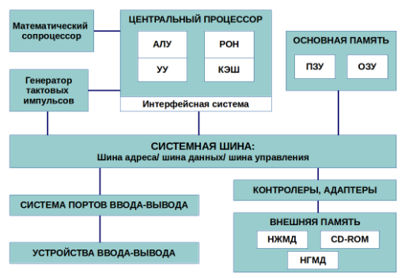

	-Взаимодействие этих устройств осуществляется через общую шину, к которой они подключены. Физически шина представляет собой большое количество проводников, соединяющих устройства друг с другом. В современных компьютерах проводники выполнены в виде электропроводящих дорожек на материнской (системной) плате.
	-Основной задачей процессора является обработка информации, а также организация координации всех узлов компьютера. В состав центрального процессора (ЦП) входят следующие устройства:
	• арифметико-логическое устройство (АЛУ) — выполняет логические и 	арифметические действия, необходимые для обработки информации, 	хранящейся в памяти;
	• устройство управления (УУ) — обеспечивает управление и контроль всех 	устройств компьютера;
	• регистры — сверхбыстрая оперативная память небольшого объёма, входящая 	в состав процессора, для временного хранения промежуточных результатов 	выполнения инструкций; регистры процессора делятся на два типа: регистры 	общего назначения и специальные регистры.
	-Для того, чтобы писать программы на ассемблере, необходимо знать, какие регистры процессора существуют и как их можно использовать. Большинство команд в программах написанных на ассемблере используют регистры в качестве операндов. Практически все команды представляют собой преобразование данных хранящихся в регистрах процессора, это например пересылка данных между регистрами или между регистрами и памятью, преобразование (арифметические или логические операции) данных хранящихся в регистрах.
	-Доступ к регистрам осуществляется не по адресам, как к основной памяти, а по именам. Каждый регистр процессора архитектуры x86 имеет свое название, состоящее из 2 или 3 букв латинского алфавита.
	-В качестве примера приведем названия основных регистров общего назначения (именно эти регистры чаще всего используются при написании программ):
	• RAX, RCX, RDX, RBX, RSI, RDI — 64-битные
	• EAX, ECX, EDX, EBX, ESI, EDI — 32-битные
	• AX, CX, DX, BX, SI, DI — 16-битные
	• AH, AL, CH, CL, DH, DL, BH, BL — 8-битные (половинки 16-битных 	регистров). Например: AH (high AX) — старшие 8 бит регистра AX, AL (low 	AX) — младшие 8 бит регистра AX.
	-Таким образом можно отметить, что вы можете написать в своей программе, например, такие команды (mov – команда пересылки данных на языке ассемблера):
mov ax, 1
mov eax, 1
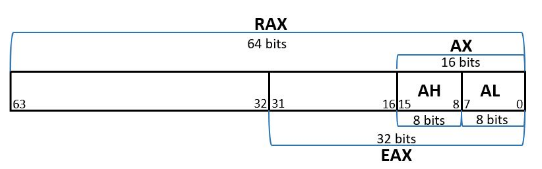
	-Обе команды поместят в регистр AX число 1. Разница будет заключаться только в том, что вторая команда обнулит старшие разряды регистра EAX, то есть после выполнения второй команды в регистре EAX будет число 1. А первая команда оставит в старших разрядах регистра EAX старые данные. И если там были данные, отличные от нуля, то после выполнения первой команды в регистре EAX будет какое-то число, но не 1. А вот в регистре AX будет число 1.
	-Другим важным узлом ЭВМ является оперативное запоминающее устройство (ОЗУ). ОЗУ — это быстродействующее энергозависимое запоминающее устройство, которое напрямую взаимодействует с узлами процессора, предназначенное для хранения программ и данных, с которыми процессор непосредственно работает в текущий момент. ОЗУ состоит из одинаковых пронумерованных ячеек памяти. Номер ячейки памяти — это адрес хранящихся в ней данных.
	-В состав ЭВМ также входят периферийные устройства, которые можно разделить на:
	• устройства внешней памяти, которые предназначены для долговременного 	хранения больших объёмов данных (жёсткие диски, твердотельные накопители, 	магнитные ленты);
	• устройства ввода-вывода, которые обеспечивают взаимодействие ЦП с 	внешней средой.
	-В основе вычислительного процесса ЭВМ лежит принцип программного управления. Это означает, что компьютер решает поставленную задачу как последовательность действий, записанных в виде программы. Программа состоит из машинных команд, которые указывают, какие операции и над какими данными (или операндами), в какой последовательности необходимо выполнить.
Набор машинных команд определяется устройством конкретного процессора. Коды команд представляют собой многоразрядные двоичные комбинации из 0 и 1. В коде машинной команды можно выделить две части: операционную и адресную. В операционной части хранится код команды, которую необходимо выполнить. В адресной части хранятся данные или адреса данных, которые участвуют в выполнении данной операции.
	-При выполнении каждой команды процессор выполняет определённую последовательность стандартных действий, которая называется командным циклом процессора. В самом общем виде он заключается в следующем:
	1. формирование адреса в памяти очередной команды;
	2. считывание кода команды из памяти и её дешифрация;
	3. выполнение команды;
	4. переход к следующей команде.
	-Данный алгоритм позволяет выполнить хранящуюся в ОЗУ программу. Кроме того, в зависимости от команды при её выполнении могут проходить не все этапы.
	-Более подробно введение о теоретических основах архитектуры ЭВМ см. в [9; 11].
	
	
##**2.2. Ассемблер и язык ассемблера**
	-Язык ассемблера (assembly language, сокращённо asm) — машинно-ориентированный язык низкого уровня. Можно считать, что он больше любых других языков приближен к архитектуре ЭВМ и её аппаратным возможностям, что позволяет получить к ним более полный доступ, нежели в языках высокого уровня, таких как C/C++, Perl, Python и пр. Заметим, что получить полный доступ к ресурсам компьютера в современных архитектурах нельзя, самым низким уровнем работы прикладной программы является обращение напрямую к ядру операционной системы. Именно на этом уровне и работают программы, написанные на ассемблере. Но в отличие от языков высокого уровня ассемблерная программа содержит только тот код, который ввёл программист. Таким образом язык ассемблера — это язык, с помощью которого понятным для человека образом пишутся команды для процессора.
	-Следует отметить, что процессор понимает не команды ассемблера, а последовательности из нулей и единиц — машинные коды. До появления языков ассемблера программистам приходилось писать программы, используя только лишь машинные коды, которые были крайне сложны для запоминания, так как представляли собой числа, записанные в двоичной или шестнадцатеричной системе счисления. Преобразование или трансляция команд с  языка ассемблера в исполняемый машинный код осуществляется специальной программой транслятором—Ассемблер. 
	-Программы, написанные на языке ассемблера, не уступают в качестве и скорости программам, написанным на машинном языке, так как транслятор просто переводит мнемонические обозначения команд в последовательности бит (нулей и единиц).
	-Используемые мнемоники обычно одинаковы для всех процессоров одной архитектуры или семейства архитектур (среди широко известных — мнемоники процессоров и контроллеров x86, ARM, SPARC, PowerPC,M68k). Таким образом для каждой архитектуры существует свой ассемблер и, соответственно, свой язык ассемблера.
	-Наиболее распространёнными ассемблерами для архитектуры x86 являются:
	• для DOS/Windows: Borland Turbo Assembler (TASM), Microsoft Macro Assembler 	(MASM) и Watcom assembler (WASM);
	• для GNU/Linux: gas (GNU Assembler), использующий AT&T-синтаксис, в отличие от
	большинства других популярных ассемблеров, которые используют Intel-синтаксис.
	-Более подробно о языке ассемблера см., например, в [10].
	-В нашем курсе будет использоваться ассемблер NASM (Netwide Assembler) [7; 12; 	14].
	-NASM — это открытый проект ассемблера, версии которого доступны под различные операционные системы и который позволяет получать объектные файлы для этих систем. В NASM используется Intel-синтаксис и поддерживаются инструкции x86-64.
	-Типичный формат записи команд NASM имеет вид:
	[метка:] мнемокод [операнд {, операнд}] [; комментарий]
	-Здесь мнемокод — непосредственно мнемоника инструкции процессору, которая является обязательной частью команды. Операндами могут быть числа, данные, адреса регистров или адреса оперативной памяти. Метка — это идентификатор, с которым ассемблер ассоциирует некоторое число, чаще всего адрес в памяти. Т.о. метка перед командой связана с адресом данной команды.
	-Допустимыми символами в метках являются буквы, цифры, а также следующие символы:
_, $, #, @,~,. и ?.
	-Начинаться метка или идентификатор могут с буквы, ., _ и ?. Перед идентификаторами, которые пишутся как зарезервированные слова, нужно писать $, чтобы компилятор трактовал его верно (так называемое экранирование). Максимальная длина идентификатора 4095 символов.
	-Программа на языке ассемблера также может содержать директивы — инструкции, не переводящиеся непосредственно в машинные команды, а управляющие работой транслятора. Например, директивы используются для определения данных (констант и переменных) и обычно пишутся большими буквами.
	
	
##**2.3. Процесс создания и обработки программы на языке ассемблера**
	-Процесс создания ассемблерной программы можно изобразить в виде следующей схемы (рис. 2.3).
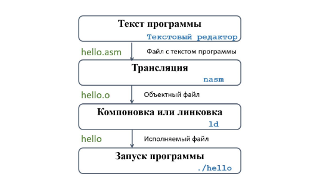
	-В процессе создания ассемблерной программы можно выделить четыре шага:
	• Набор текста программы в текстовом редакторе и сохранение её в отдельном файле. 	Каждый файл имеет свой тип (или расширение), который определяет назначение 	файла. Файлы с исходным текстом программ на языке ассемблера имеют тип asm.
	• Трансляция — преобразование с помощью транслятора, например nasm, текста про-	граммы в машинный код, называемый объектным. На данном этапе также может быть 	получен листинг программы, содержащий кроме текста программы различную допол- 	нительную информацию, созданную транслятором. Тип объектного файла — o, файла	листинга — lst.
	• Компоновка или линковка — этап обработки объектного кода компоновщиком (ld), 	который принимает на вход объектные файлы и собирает по ним исполняемый файл. 	Исполняемый файл обычно не имеет расширения. Кроме того, можно получить файл 	карты загрузки программы в ОЗУ, имеющий расширение map.
	• Запуск программы. Конечной целью является работоспособный исполняемый файл. 	Ошибки на предыдущих этапах могут привести к некорректной работе программы, 	поэтому может присутствовать этап отладки программы при помощи специальной 	программы — отладчика. При нахождении ошибки необходимо провести коррекцию 	программы, начиная с первого шага.
	-Из-за специфики программирования, а также по традиции для создания программ на языке ассемблера обычно пользуются утилитами командной строки (хотя поддержка ассемблера есть в некоторых универсальных интегрированных средах).
	
	
#**3. Порядок выполнения лабораторной работы**

##**3.1. Программа Hello world!**
	-Рассмотрим пример простой программы на языке ассемблера NASM. Традиционно первая программа выводит приветственное сообщение Hello world! на экран. 
	-Создал каталог для работы с программами на языке ассемблера NASM: (рис. 3.1.)
aymatienkodk4n58@fedora:~$ mkdir -p ~/work/arch-pc/lab04
	-Перешел в созданный каталог:
aymatienkodk4n58@fedora:~$ cd ~/work/arch-pc/lab04
	-Создал текстовый файл с именем hello.asm:
aymatienkodk4n58@fedora:~/work/arch-pc/lab04$ touch hello.asm
	-Открыл этот файл с помощью любого текстового редактора, например, gedit:
aymatienkodk4n58@fedora:~/work/arch-pc/lab04$ gedit hello.asm
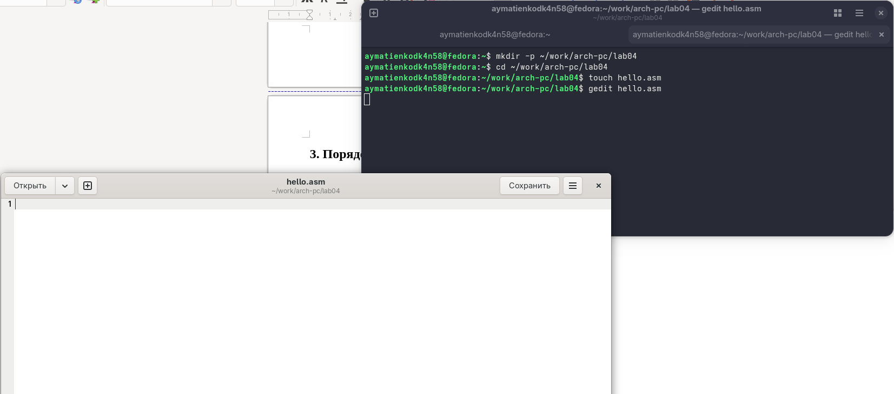

и ввел в него следующий текст: (рис.3.2)
; hello.asm
SECTION .data ; Начало секции данных
	hello: DB 'Hello world!',10 ; 'Hello world!' плюс
					; символ перевода строки
	helloLen: EQU $-hello ; Длина строки hello
SECTION .text ; Начало секции кода
	GLOBAL _start
_start: ; Точка входа в программу
	mov eax,4 ; Системный вызов для записи (sys_write)
	mov ebx,1 ; Описатель файла '1' - стандартный вывод
	mov ecx,hello ; Адрес строки hello в ecx
	mov edx,helloLen ; Размер строки hello
	int 80h ; Вызов ядра
	mov eax,1 ; Системный вызов для выхода (sys_exit)
	mov ebx,0 ; Выход с кодом возврата '0' (без ошибок)
	int 80h ; Вызов ядра
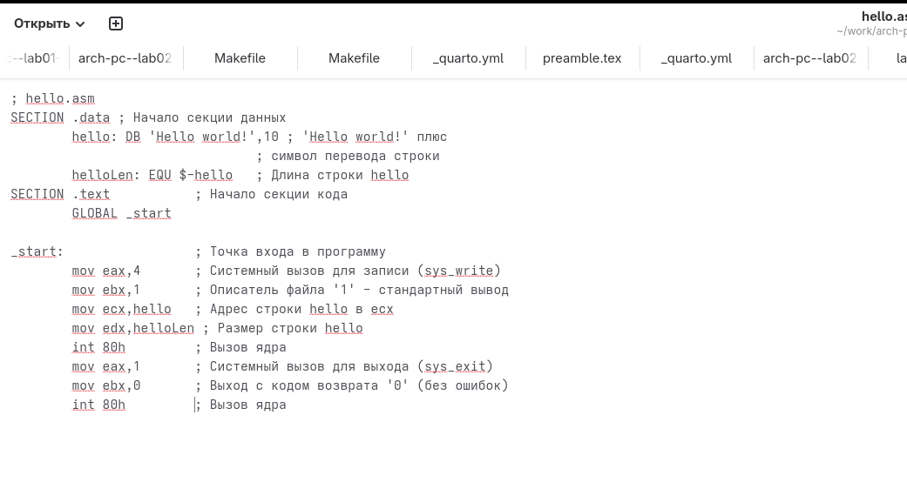
	-В отличие от многих современных высокоуровневых языков программирования, в ассемблерной программе каждая команда располагается на отдельной строке. Размещение нескольких команд на одной строке недопустимо. Синтаксис ассемблера NASM является чувствительным к регистру, т.е. есть разница между большими и малыми буквами.
	
	
##**3.2. Транслятор NASM**
	-NASM превращает текст программы в объектный код. Например, для компиляции приведённого выше текста программы «Hello World» необходимо написать:
aymatienkodk4n58@fedora:~/work/arch-pc/lab04$ nasm -f elf hello.asm
	-Если текст программы набран без ошибок, то транслятор преобразует текст программы из файла hello.asm в объектный код, который запишется в файл hello.o. Таким образом, имена всех файлов получаются из имени входного файла и расширения по умолчанию. При наличии ошибок объектный файл не создаётся, а после запуска транслятора появятся сообщения об ошибках или предупреждения.
	-С помощью команды ls проверил, что объектный файл был создан. И файл назван «hello.o» (рис.3.3.)
aymatienkodk4n58@fedora:~/work/arch-pc/lab04$ ls
hello.asm  hello.o
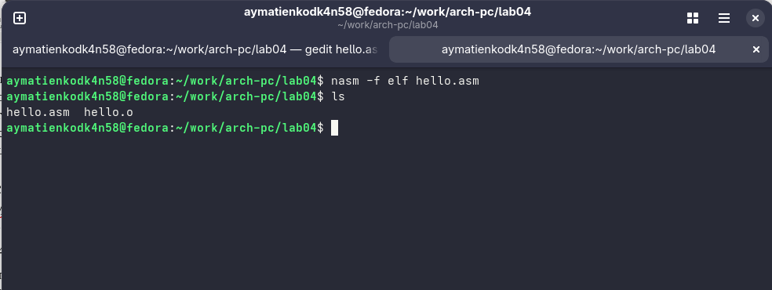
	-NASM не запускают без параметров. Ключ -f указывает транслятору, что требуется создать бинарные файлы в формате ELF. Следует отметить, что формат elf64 позволяет создавать исполняемый код, работающий под 64-битными версиями Linux. Для 32-битных версий ОС казываем в качестве формата просто elf.
	-NASM всегда создаёт выходные файлы в текущем каталоге.
	
	
##**3.3. Расширенный синтаксис командной строки NASM**
	-Полный вариант командной строки nasm выглядит следующим образом:(рис.3.4.)
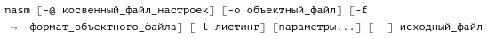 ппппппп.png
	-Выполните следующую команду:(рис.3.5.)
aymatienkodk4n58@fedora:~/work/arch-pc/lab04$ nasm -o obj.o -f elf -g -l list.lst hello.asm
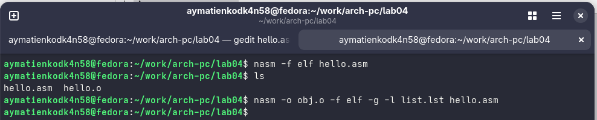 
	-Данная команда скомпилирует исходный файл hello.asm в obj.o (опция -o позволяет задать имя объектного файла, в данном случае obj.o), при этом формат выходного файла будет elf, и в него будут включены символы для отладки (опция -g), кроме того, будет создан файл листинга list.lst (опция -l).
	-С помощью команды ls проверил, что файлы были созданы. (рис.3.6.)
aymatienkodk4n58@fedora:~/work/arch-pc/lab04$ ls
hello.asm  hello.o  list.lst  obj.o
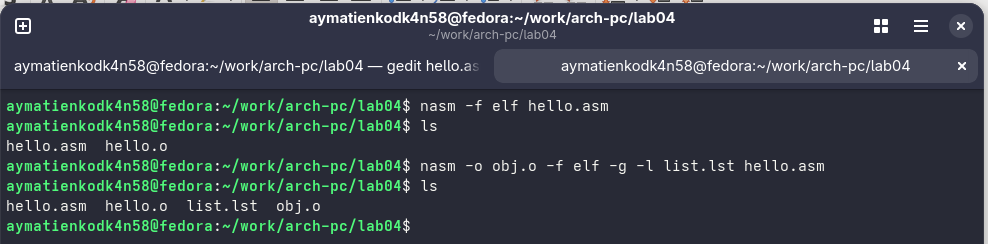 
	-Для более подробной информации см. man nasm. Для получения списка форматов объектного файла см. nasm -hf.
	

##**3.4. Компоновщик LD**
	-Как видно из схемы на (рис. 4.3.), чтобы получить исполняемую программу, объектный файл необходимо передать на обработку компоновщику:(рис.3.7.)
aymatienkodk4n58@fedora:~/work/arch-pc/lab04$ ld -m elf_i386 hello.o -o hello
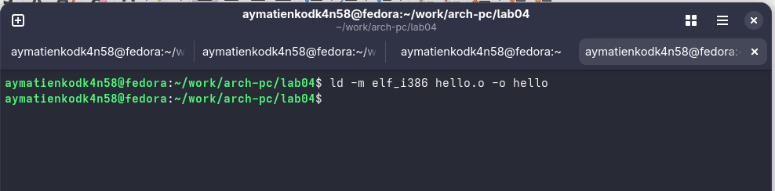

	-С помощью команды ls проверил, что исполняемый файл hello был создан.(рис.3.8.)
aymatienkodk4n58@fedora:~/work/arch-pc/lab04$ ls hello  hello.asm  hello.o  list.lst  obj.o
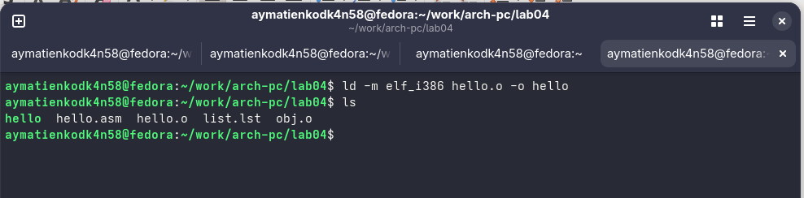
	-Компоновщик ld не предполагает по умолчанию расширений для файлов, но принято использовать следующие расширения:
	• o – для объектных файлов;
	• без расширения – для исполняемых файлов;
	• map – для файлов схемы программы;
	• lib – для библиотек.
	Ключ -o с последующим значением задаёт в данном случае имя создаваемого исполняемого файла.
	-Выполнил следующую команду:(рис.3.9.)
aymatienkodk4n58@fedora:~/work/arch-pc/lab04$ ld -m elf_i386 obj.o -o main
aymatienkodk4n58@fedora:~/work/arch-pc/lab04$ ls
hello  hello.asm  hello.o  list.lst  main  obj.o
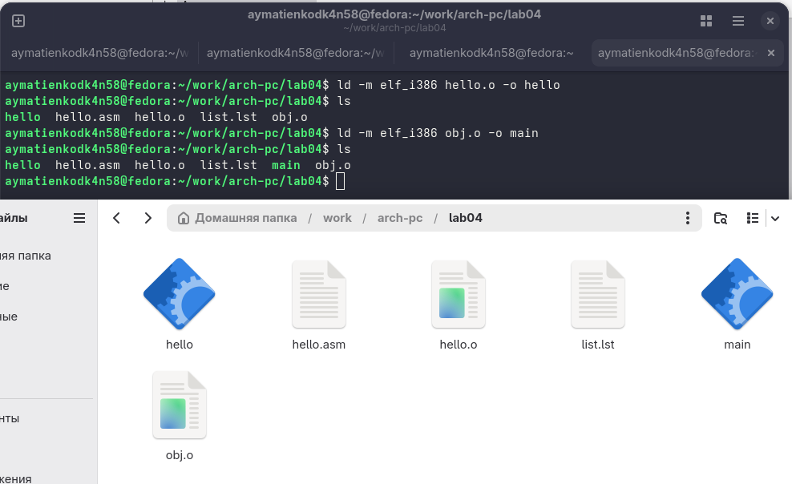
 	-Файл имеет имя «main». А имя собрано из файла «hello.asm» и «hello»(рис.3.10.)
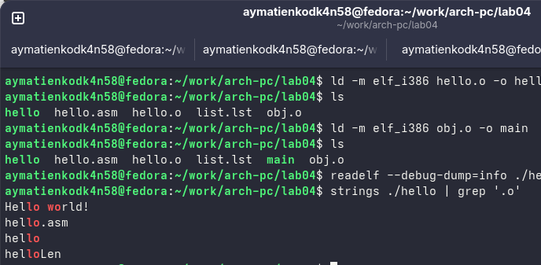
	-Формат командной строки LD можно увидеть, набрав ld --help. Для получения более подробной информации см. man ld.
	
	
##**3.5. Запуск исполняемого файла**
	-Запустил на выполнение созданный исполняемый файл, находящийся в текущем каталоге, набрав в командной строке:(рис.3.11.)
aymatienkodk4n58@fedora:~/work/arch-pc/lab04$ ./hello
Hello world!
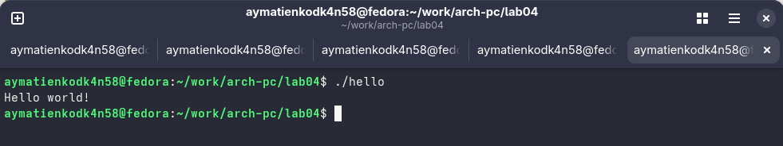 

#**4. Задание для самостоятельной работы**
	-1. В каталоге ~/work/arch-pc/lab04 с помощью команды cp создал копию файла hello.asm с именем lab4.asm:(рис.4.1.)
aymatienkodk4n58@fedora:~/work/arch-pc/lab04$ cp -i ~/work/arch-pc/lab04/hello.asm ~/work/arch-pc/lab04/lab4.asm

	-2. С помощью текстового редактора внес изменения в текст программы в
файле lab4.asm так, чтобы вместо Hello world! на экран выводилась строка с моей фамилией и именем:(рис.4.2.)
aymatienkodk4n58@fedora:~/work/arch-pc/lab04$ gedit lab4.asm
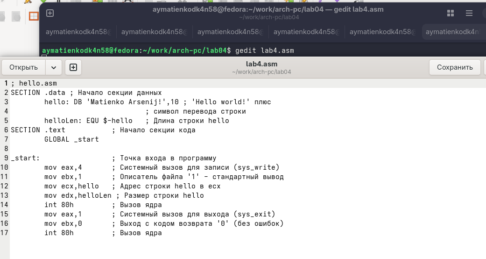

	-3. Оттранслировал полученный текст программы lab4.asm в объектный файл. Выполнил компоновку объектного файла и запустил получившийся исполняемый файл.(рис.4.3.)
aymatienkodk4n58@fedora:~/work/arch-pc/lab04$ nasm -f elf lab4.asm
aymatienkodk4n58@fedora:~/work/arch-pc/lab04$ nasm -o obj.o -f elf -g -l list2.lst lab4.asm
aymatienkodk4n58@fedora:~/work/arch-pc/lab04$ ld -m elf_i386 lab4.o -o lab4
aymatienkodk4n58@fedora:~/work/arch-pc/lab04$ ./lab4
Matienko Arsenij!
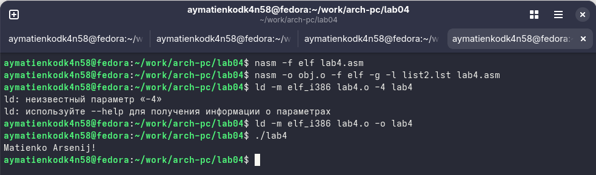

	-4. Скопировал файлы hello.asm и lab4.asm в свой локальный репозиторий в каталог~/work/study/2025-2026/"Архитектура компьютера"/study_2025-2026_arh-pc/labs/lab04/(рис.4.4.)
Загрузил файлы на Github.(рис.4.4.)
aymatienkodk4n58@fedora:~$ cd ~/work/arch-pc/lab04
aymatienkodk4n58@fedora:~/work/arch-pc/lab04$ cp -vi hello.asm lab4.asm hello hello.o lab4 lab4.o list.lst list2.lst main obj.o "$HOME/work/study/2025-2026/Архитектура компьютера/study_2025-2026_arh-pc/labs/lab04/"
aymatienkodk4n58@fedora:~/work/arch-pc/lab04$ cd 
aymatienkodk4n58@fedora:~$ cd ~/work/study/2025-2026/"Архитектура компьютера"/study_2025-2026_arh-pc/labs/lab04/
aymatienkodk4n58@fedora:~/work/study/2025-2026/Архитектура компьютера/study_2025-2026_arh-pc/labs/lab04$ ./hello
Hello world!
aymatienkodk4n58@fedora:~/work/study/2025-2026/Архитектура компьютера/study_2025-2026_arh-pc/labs/lab04$ ./lab4
Matienko Arsenij!
aymatienkodk4n58@fedora:~/work/study/2025-2026/Архитектура компьютера/study_2025-2026_arh-pc/labs/lab04~$ git add .
aymatienkodk4n58@fedora:~/work/study/2025-2026/Архитектура компьютера/study_2025-2026_arh-pc/labs/lab04~$ git commit -am 'feat(main): add files lab-4'
aymatienkodk4n58@fedora:~/work/study/2025-2026/Архитектура компьютера/study_2025-2026_arh-pc/labs/lab04~$ git push
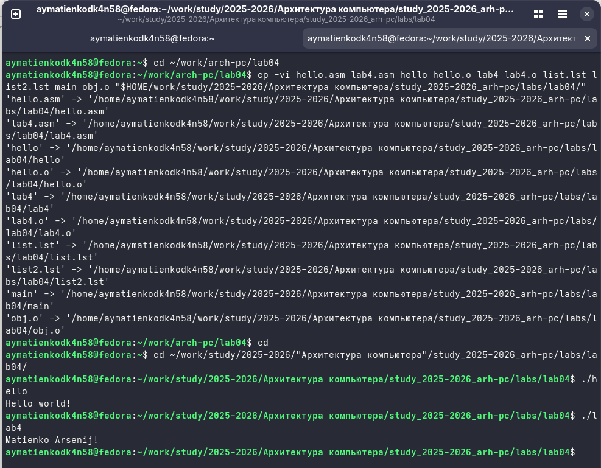

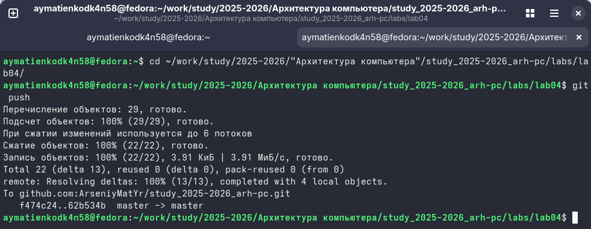
#**5. Вывод**
	-В результате лабораторной работы были освоены процедуры компиляции и сборки программ, написанных на ассемблере NASM.
