**РОССИЙСКИЙ УНИВЕРСИТЕТ ДРУЖБЫ НАРОДОВ**
**Факультет физико-математических и естественных наук**
**Кафедра прикладной информатики и теории вероятностей**

**ОТЧЕТ**
**по лабораторной работе № 5**
дисциплина:	Архитектура компьютера

Студент: Матиенко 
Арсений Юрьевич

Группа: НБИбд-02-25 

**МОСКВА**
2025 г.

**Оглавление**
1. Цель работы	3
2. Теоретическое введение	3
2.1. Основы работы с Midnight Commander	3
2.2. Структура программы на языке ассемблера NASM	4
2.3. Элементы программирования на mov	8
2.4. Элементы программирования на int	9
2.4. Системные вызовы для обеспечения диалога с пользователем	9
3. Порядок выполнения лабораторной работы	10
3.1. Подключение внешнего файла in_out.asm	16
4. Задание для самостоятельной работы	23
5. Вывод	25

#**1. Цель работы**
	-Приобретение практических навыков работы в Midnight Commander. Освоение инструкций языка ассемблера mov и int.

#**2. Теоретическое введение**

##**2.1. Основы работы с Midnight Commander**
	-Midnight Commander (или просто mc) — это программа, которая позволяет просматривать структуру каталогов и выполнять основные операции по управлению файловой системой, т.е. mc является файловым менеджером. Midnight Commander позволяет сделать работу с файлами более удобной и наглядной.
	-Для активации оболочки Midnight Commander достаточно ввести в командной строке mc и нажать клавишу Enter (рис. 2.1).
	-В Midnight Commander используются функциональные клавиши F1 — F10 , к которым привязаны часто выполняемые операции (рис. 2.1)
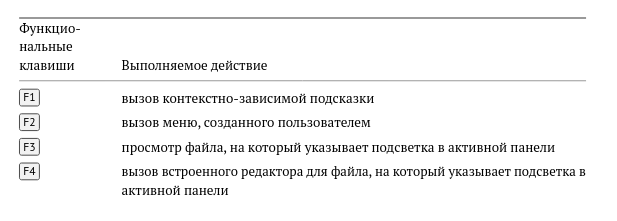
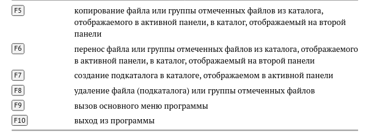

 	-Следующие комбинации клавиш облегчают работу с Midnight Commander:
    • Tab используется для переключениями между панелями;
    • ↑ и ↓ используется для навигации, Enter для входа в каталог или открытия файла (если в файле расширений mc.ext заданы правила связи определённых расширений файлов с инструментами их запуска или обработки);
    • Ctrl + u (или через меню Команда > Переставить панели ) меняет местами содержимое правой и левой панелей;
    • Ctrl + o (или через меню Команда > Отключить панели ) скрывает или возвращает панели Midnight Commander, за которыми доступен для работы командный интерпретатор оболочки и выводимая туда информация.
    • Ctrl + x + d (или через меню Команда > Сравнить каталоги ) позволяет сравнить содержимое каталогов, отображаемых на левой и правой панелях.

##**2.2. Структура программы на языке ассемблера NASM**
	-Программа на языке ассемблера NASM, как правило, состоит из трёх секций: секция кода программы (SECTION .text), секция инициированных (известных во время компиляции) данных (SECTION .data) и секция неинициализированных данных (тех, под которые во время компиляции только отводится память, а значение присваивается в ходе выполнения программы) (SECTION .bss). 
	-Таким образом, общая структура программы имеет следующий вид:(рис.2.2.)

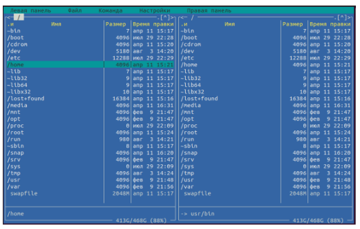
SECTION .bss 	; Секция содержит переменные, для
... 			; которых не задано начальное значение

SECTION .text 	; Секция содержит код программы
	GLOBAL _start
	_start: 		; Точка входа в программу
		
... 			; Текст программы
	mov eax,1 	; Системный вызов для выхода (sys_exit)
	mov ebx,0 	; Выход с кодом возврата 0 (без ошибок)
	int 80h 	; Вызов ядра
	-Для объявления инициированных данных в секции .data используются директивы DB, DW, DD, DQ и DT, которые резервируют память и указывают, какие значения должны храниться в этой памяти:
    • DB (define byte) — определяет переменную размером в 1 байт;
    • DW (define word) — определяет переменную размеров в 2 байта (слово);
    • DD (define double word) — определяет переменную размером в 4 байта (двойное слово);
    • DQ (define quad word) — определяет переменную размером в 8 байт (учетверённое слово);
    • DT (define ten bytes) — определяет переменную размером в 10 байт.
	-Директивы используются для объявления простых переменных и для объявления массивов. Для определения строк принято использовать директиву DB в связи с особенностями хранения данных в оперативной памяти.
	-Синтаксис директив определения данных следующий:(рис.2.4.)
<имя> DB <операнд> [, <операнд>] [, <операнд>]
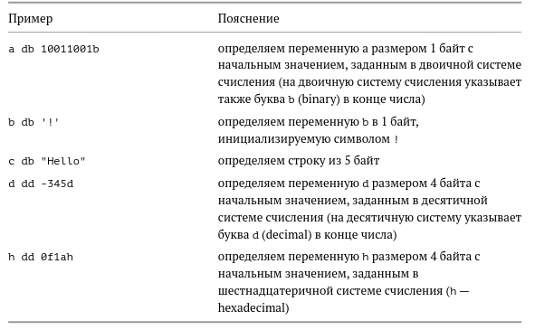

 	-Для объявления неинициированных данных в секции .bss используются директивы resb, resw, resd и другие, которые сообщают ассемблеру, что необходимо зарезервировать заданное количество ячеек памяти. Примеры их использования приведены в рис. 2.5.
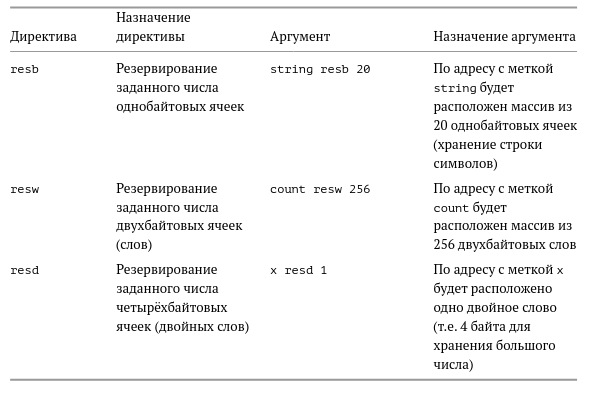

##**2.3. Элементы программирования на mov**
	-Инструкция языка ассемблера mov предназначена для дублирования данных источника в приёмнике. В общем виде эта инструкция записывается в виде
mov dst,src
Здесь операнд dst — приёмник, а src — источник. В качестве операнда могут выступать регистры (register), ячейки памяти (memory) и непосредственные значения (const). В рис. 2.6 приведены варианты использования mov с разными операндами.
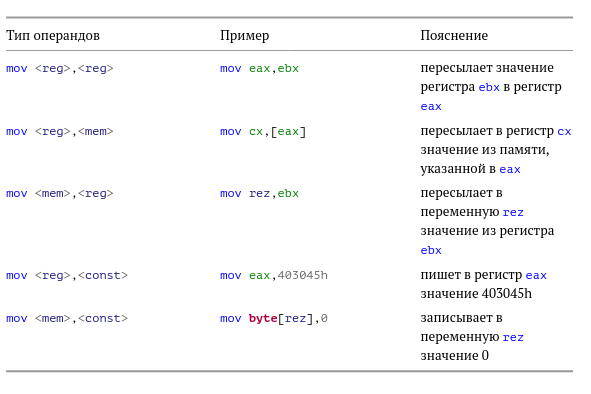
 
	-ВАЖНО! Переслать значение из одной ячейки памяти в другую нельзя, для этого необходимо использовать две инструкции mov:
mov eax, x
mov y, eax
	-Также необходимо учитывать то, что размер операндов приемника и источника должны совпадать. Использование слудующих примеров приведет к ошибке:
    • mov al,1000h — ошибка, попытка записать 2-байтное число в 1-байтный регистр;
    • mov eax,cx — ошибка, размеры операндов не совпадают.
    
##**2.4. Элементы программирования на int**
	-Инструкция языка ассемблера intпредназначена для вызова прерывания с указанным номером. В общем виде она записывается в виде int n
	-Здесь n — номер прерывания, принадлежащий диапазону 0–255.
	-При программировании в Linux с использованием вызовов ядра sys_calls n=80h (принято задавать в шестнадцатеричной системе счисления).
	-После вызова инструкции int 80h выполняется системный вызов какой-либо функции ядра Linux. При этом происходит передача управления ядру операционной системы. Чтобы узнать, какую именно системную функцию нужно выполнить, ядро извлекает номер системного вызова из регистра eax. Поэтому перед вызовом прерывания необходимо поместить в этот регистр нужный номер. Кроме того, многим системным функциям требуется передавать какие-либо параметры. По принятым в ОС Linux правилам эти параметры помещаются в порядке следования в остальные регистры процессора: ebx, ecx, edx. Если системная функция должна вернуть значение, то она помещает его в регистр eax. 
	
##**2.4.  Системные вызовы для обеспечения диалога с пользователем**
	-Простейший диалог с пользователем требует наличия двух функций — вывода текста на экран и ввода текста с клавиатуры. Простейший способ вывести строку на экран — использовать системный вызов write. Этот системный вызов имеет номер 4, поэтому перед вызовом инструкции int необходимо поместить значение 4 в регистр eax. Первым аргументом write, помещаемым в регистр ebx, задаётся дескриптор файла. Для вывода на экран в качестве дескриптора файла нужно указать 1 (это означает «стандартный вывод», т. е. вывод на экран). Вторым аргументом задаётся адрес выводимой строки (помещаем его в регистр ecx, например, инструкцией mov ecx, msg). Строка может иметь любую длину. Последним аргументом (т.е. в регистре edx) должна задаваться максимальная длина выводимой строки.
	-Для ввода строки с клавиатуры можно использовать аналогичный системный вызов read. Его аргументы – такие же, как у вызова write, только для «чтения» с клавиатуры используется файловый дескриптор 0 (стандартный ввод).
	-Системный вызов exit является обязательным в конце любой программы на языке ассемблер. Для обозначения конца программы перед вызовом инструкции int 80h необходимо поместить в регистр еах значение 1, а в регистр ebx код завершения 0.
	
	
#**3. Порядок выполнения лабораторной работы**
	-1. Открыл Midnight Commander: (рис.3.1)
aymatienkodk4n58@fedora:~$ mc
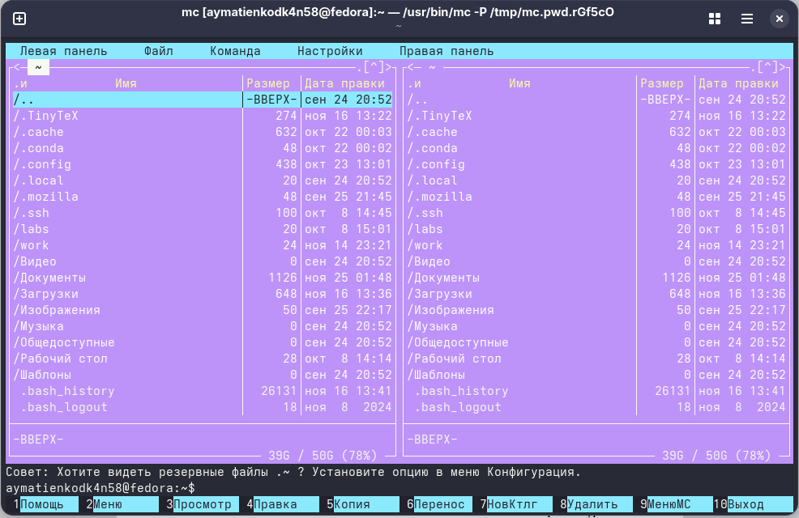

	-2. Пользуясь клавишами ↑ , ↓ и Enter перешёл в каталог ~/work/arch-pc созданный при выполнении лабораторной работы №4.
	-3. С помощью функциональной клавиши F7 создал папку lab05 и перешёл в созданный каталог. (рис.3.2)

	-4. Пользуясь строкой ввода и командой touch создал файл lab5-1.asm. (рис.3.3)
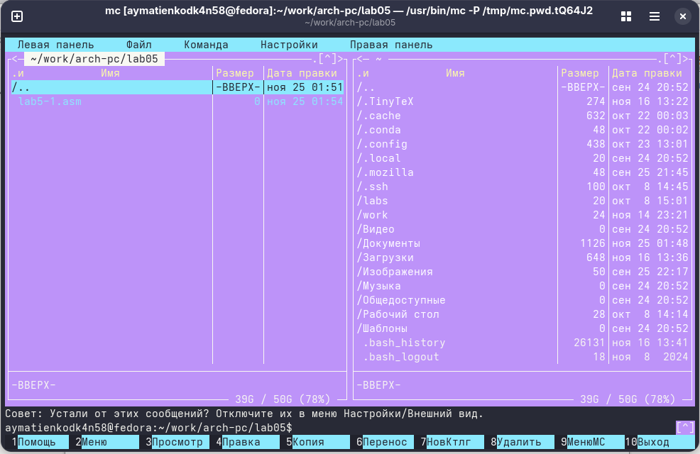
 
	-5. С помощью функциональной клавиши F4 открыл файл lab5-1.asm для редактирования во встроенном редакторе. Как правило в качестве встроенного редактора Midnight Commander используется редакторы nano  или mcedit. (рис.3.4)
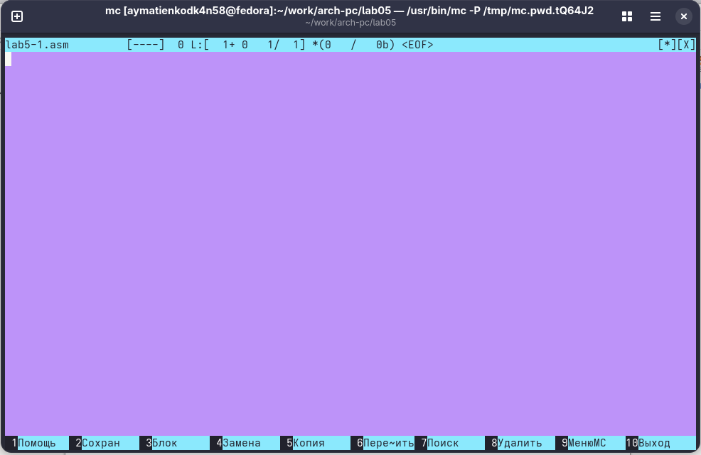

 		-6. Ввёл текст программы из листинга 3.5, сохранил изменения и закрыл файл.
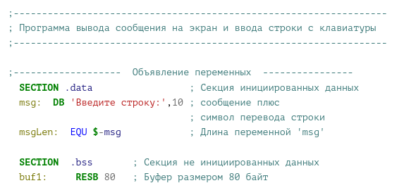
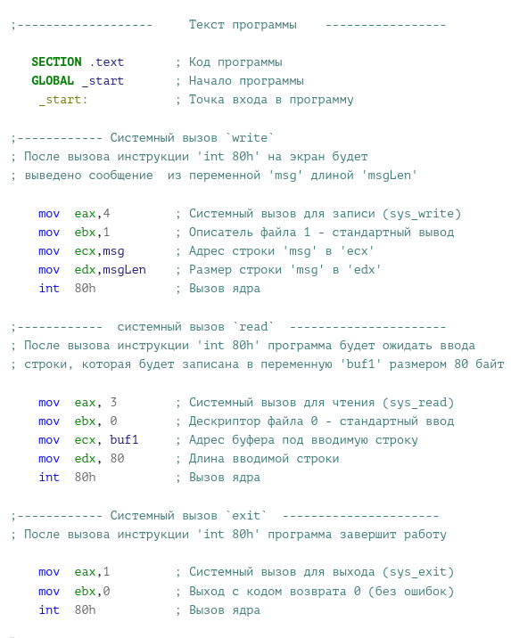
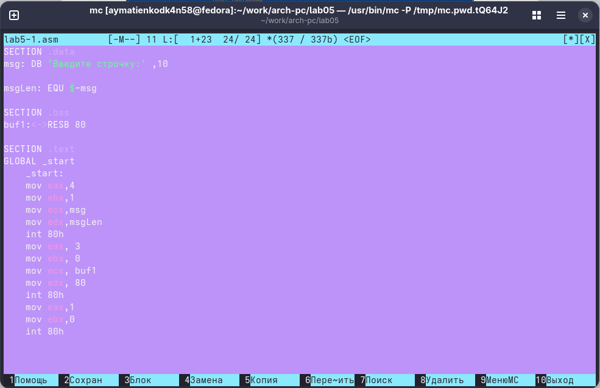
	-7. С помощью функциональной клавиши F3 открыл файл lab5-1.asm для просмотра. Убедился, что файл содержит текст программы.(рис.3.7.)
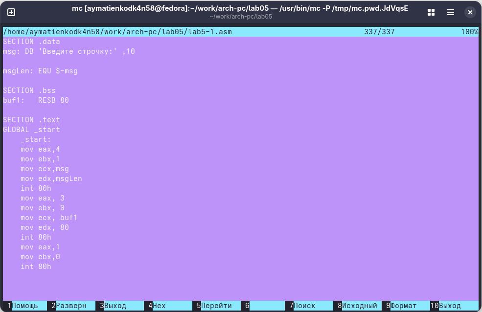

	-8. Оттранслировал текст программы lab5-1.asm в объектный файл. Выполнил компоновку объектного файла и запустил получившийся исполняемый файл. (рис.3.9.) Программа выводит строку 'Введите строку:' и ожидает ввода с клавиатуры. На запрос введите Ваши ФИО.(рис.3.8.)
aymatienkodk4n58@fedora:~/work/arch-pc/lab05$ nasm -f elf lab5-1.asm
aymatienkodk4n58@fedora:~/work/arch-pc/lab05$ ld -m elf_i386 -o lab5-1 lab5-1.o
aymatienkodk4n58@fedora:~/work/arch-pc/lab05$ ./lab5-1
Введите строчку:
Матиенко Арсений Юрьевич
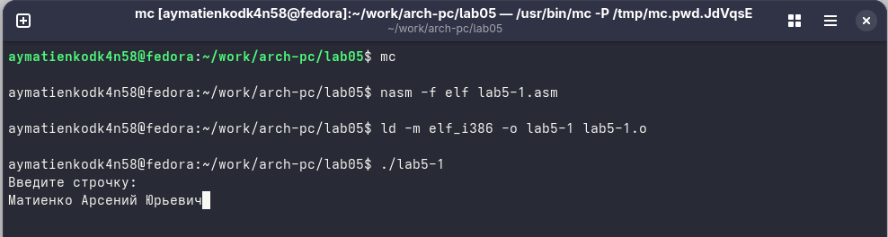
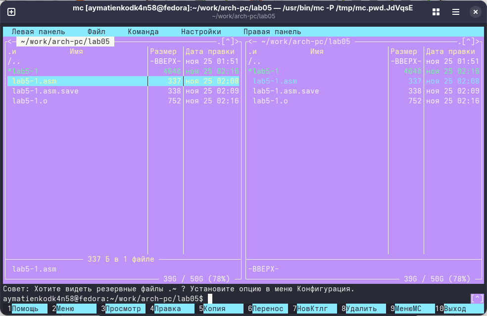

##**3.1.  Подключение внешнего файла in_out.asm**
	-Для упрощения написания программ часто встречающиеся одинаковые участки кода (такие как, например, вывод строки на экран или выход их программы) можно оформить в виде подпрограмм и сохранить в отдельные файлы, а во всех нужных местах поставить вызов нужной подпрограммы. Это позволяет сделать основную программу более удобной для написания и чтения.
	-NASM позволяет подключать внешние файлы с помощью директивы %include, которая предписывает ассемблеру заменить эту директиву содержимым файла. Подключаемые файлы также написаны на языке ассемблера. Важно отметить, что директива %include в тексте программы должна стоять раньше, чем встречаются вызовы подпрограмм из подключаемого файла. Для вызова подпрограммы из внешнего файла используется инструкция call,которая имеет следующий вид
call <function>
где function имя подпрограммы.
Для выполнения лабораторных работ использовал файл in_out.asm1:
    • slen – вычисление длины строки (используется в подпрограммах печати сообщения для определения количества выводимых байтов);
    • sprint – вывод сообщения на экран, перед вызовом sprint в регистр eax необходимо записать выводимое сообщение (mov eax,<message>);
    • sprintLF – работает аналогично sprint, но при выводе на экран добавляет к сообщению символ перевода строки;
    • sread – ввод сообщения с клавиатуры, перед вызовом sread в регистр eax необходимо записать адрес переменной в которую введенное сообщение буд записано (moveax,<buffer>) , в регистр ebx – длину вводимой строки (mov ebx,<N>);
    •  iprint – вывод на экран чисел в формате ASCII, перед вызовом iprint в регистр eax необходимо записать выводимое число (mov eax,<int>);
    •   iprintLF – работает аналогично iprint, но при выводе на экран после числа добавляет к символ перевода строки;
    •   atoi – функция преобразует ascii-код символа в целое число и записыает результат в регистр eax, перед вызовом atoi в регистр eax необходимо записать число (moveax,<int>);
    •  quit – завершение программы.
	 -9. Скачал файл in_out.asm со страницы курса в ТУИС.
	-10. Подключаемый файл in_out.asm положил в тот же каталог, что и файл с программой, в которой он используется.(рис.3.10.)

      
	-В одной из панелей mc открыл каталог с файлом lab5-1.asm. В другой панели каталог со скаченным файлом in_out.asm (для перемещения между панелями использовал Tab ). Скопировал файл in_out.asm в каталог с файлом lab5-1.asm с помощью функциональной клавиши F5. (рис.3.11)
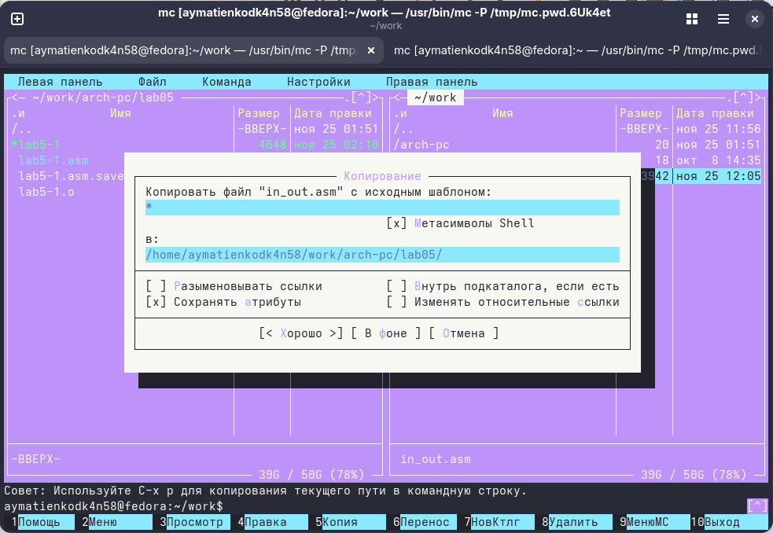

	-11. С помощью функциональной клавиши F6 создал копию файла lab5-1.asm с именем lab5-2.asm. Выделите файл lab5-1.asm, нажмите клавишу F6 , введите имя файла lab5-2.asm и нажмите клавишу Enter. (рис.3.12.)
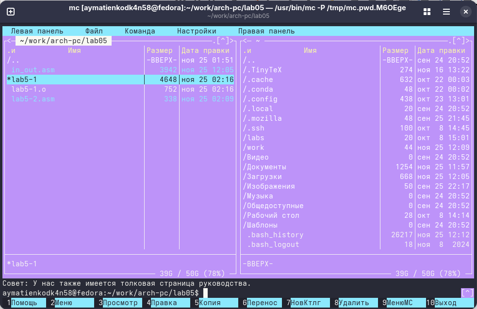

	-12. Исправил текст программы в файле lab5-2.asm с использование подпрограмм из внешнего файла in_out.asm (рис.3.14.) в соответствии с листингом рис (3.13.) Создал исполняемый файл и проверил его работу. (рис.3.15.)
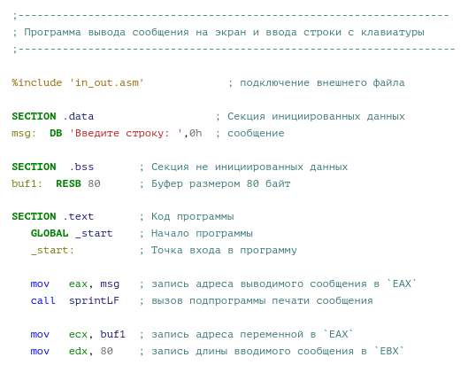

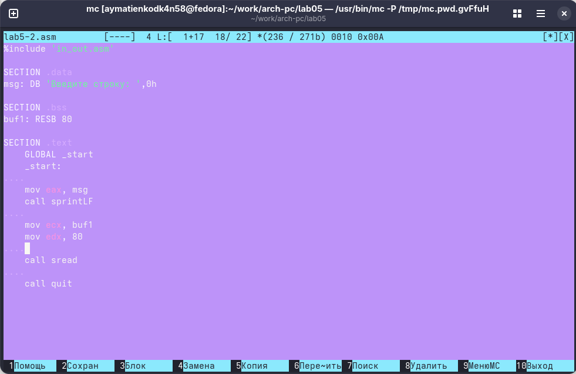
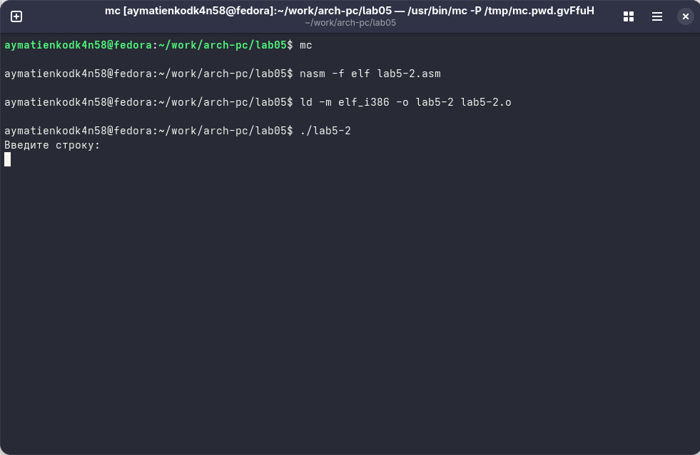

	-13. В файле lab5-2.asm заменил подпрограмму sprintLF на sprint. Создайте исполняемый файл и проверил его работу.(рис.3.17.),(рис.3.16.)
	--Разница в том, что sprintLF перемещает курсор на следующую строку, а sprint оставляет курсор на той же строке.
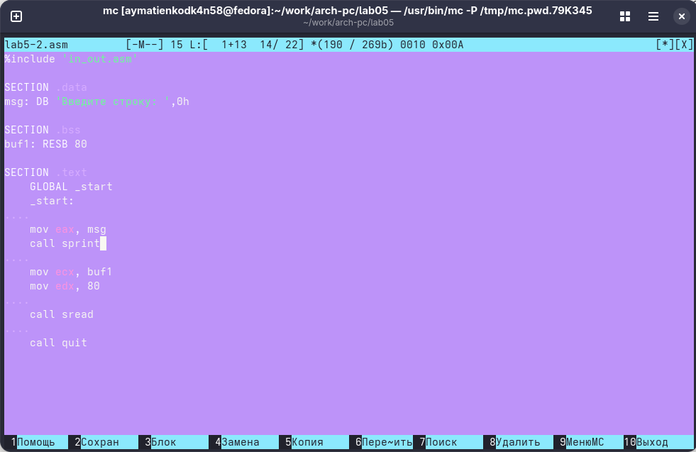
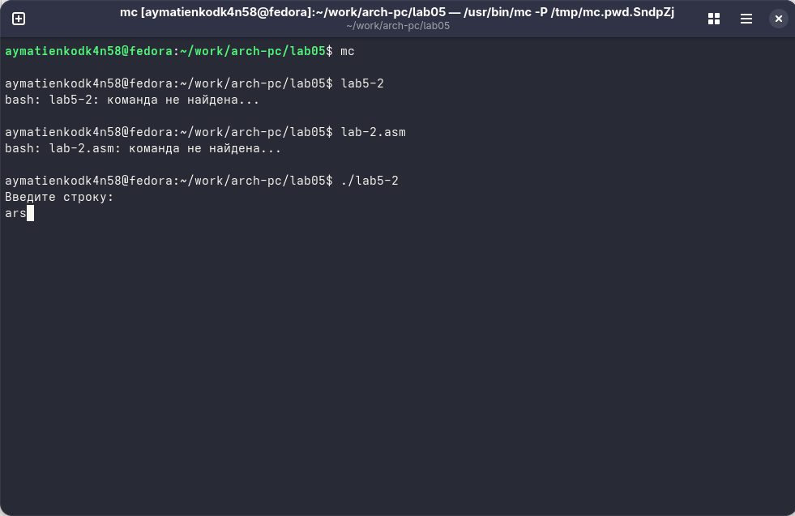

#**4. Задание для самостоятельной работы**
	-1. Создал копию файла lab5-1.asm. Внес изменения в программу (без использования внешнего файла in_out.asm), так чтобы она работала по следующему алгоритму:(рис.4.1.)
    • вывести приглашение типа “Введите строку:”;
    • ввести строку с клавиатуры;
    • вывести введённую строку на экран.
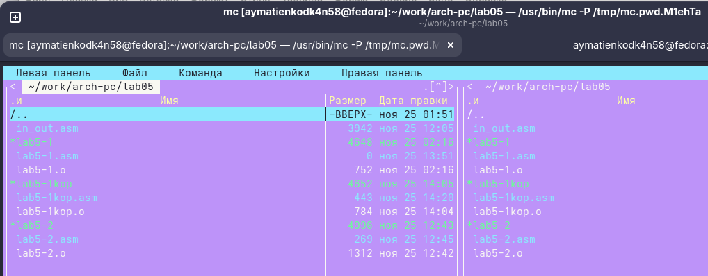
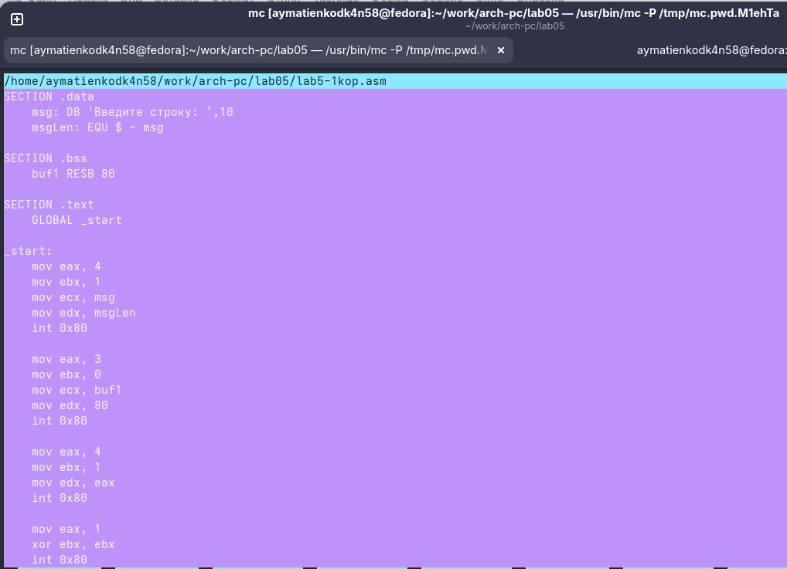

	-2. Получил исполняемый файл и проверил его работу. На приглашение ввести строку ввел свою фамилию.(рис.4.3.)
(к сожалению программа выводит только первые две буквы)
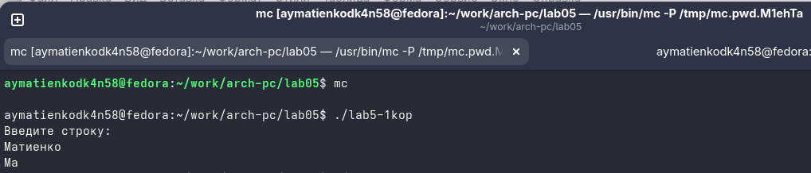

	-3. Создайте копию файла lab5-2.asm. Исправьте текст программы с использование подпрограмм из внешнего файла in_out.asm, так чтобы она работала по следующему алгоритму:(рис 4.4.)
    • вывести приглашение типа “Введите строку:”;
    • ввести строку с клавиатуры;
    • вывести введённую строку на экран.

	-4. Создал исполняемый файл и проверил его работу.(рис.4.5.)
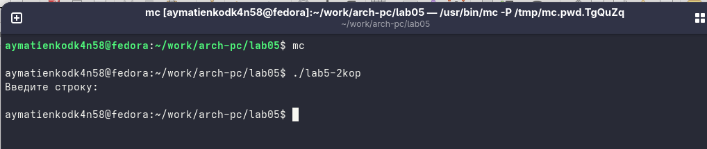 

 
#**5. Вывод**
	Приобретение практических навыков работы в Midnight Commander и освоение инструкций языка ассемблера mov и int позволяет разработчику эффективно управлять файлами и глубже понять принципы работы Ассемблера.	
